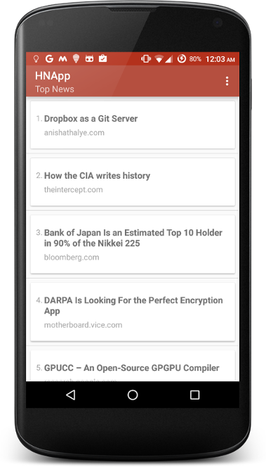

## HackerNews App (Unofficial)

A simple unofficial [HackerNews](http://news.ycombinator.com) app, can be used to browse the _top news_ on HackerNews.

### Libraries / APIs used :

* [HackerNews API](https://github.com/HackerNews/API)
* [Firebase Android Client](https://www.firebase.com/docs/android/)

### Screenshots

### Download
[Download Apk](https://github.com/shahzar/HNApp/raw/master/HNApp_v0.1.apk)
